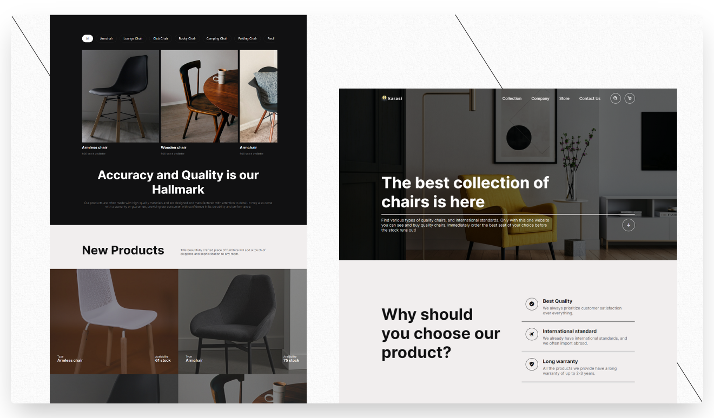

  
  
  
  
  
  
  <h2 align="center">karasi - A furniture website concept mainly about chairs.</h2>

  Built this for educational purposes only.

  <a href="https://karasi.netlify.app/"><strong>➥ Live Demo</strong></a>

### Preview

### Overview
- Developed using Mobile First Approach.
- Responsive on all devices.
- SEO optimized.

### Tools Used
- Icons: https://boxicons.com/
- Images: https://www.pexels.com/

### Built With
- HTML5
- CSS3
- Javascript

### ORIGINAL DRIBBLE DESIGN
- by Nizar Ali: https://dribbble.com/shots/19914777-Kursinan-Furniture-Landing-Page/attachments/15008594?mode=media

### Feedback
- If you have any feedback, please reach out to me at mabiorduom5@gmail.com
